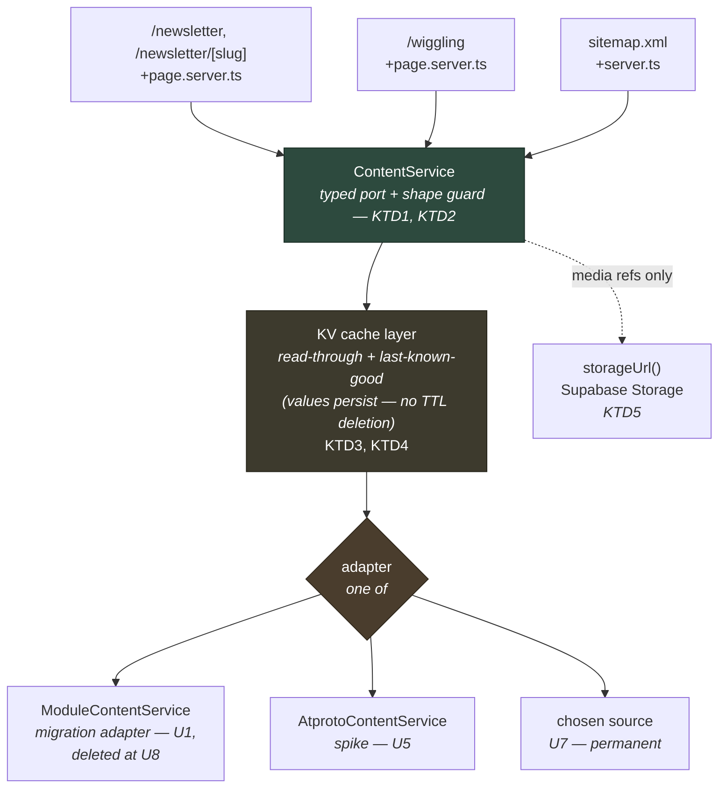
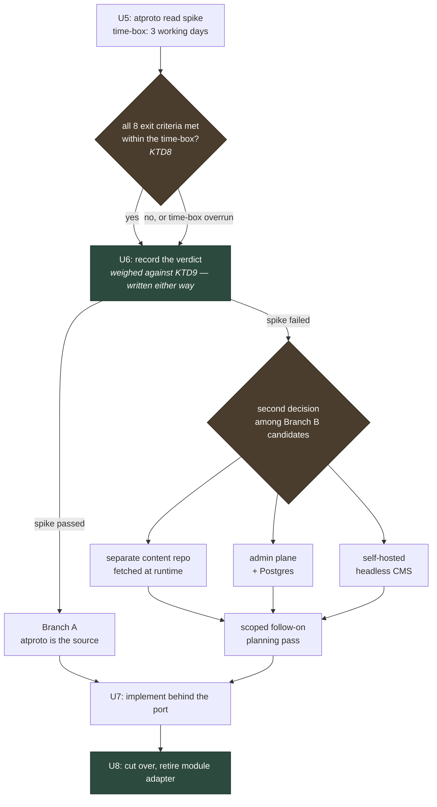

# feat: Decouple content delivery from the deploy cycle

## Summary

Publishing a newsletter essay or adding a Wiggling entry currently means a pull request, a review, and a production deploy. This plan removes that coupling, with one addition: both recent essays also needed renderer changes to ship, so the content model must widen at the same time. Both moves are in scope.

The work runs in two separable movements. First, a source-agnostic content boundary — a typed `ContentService` port with swappable implementations — lands behind the existing routes with no behaviour change and no source decision. Second, an atproto read spike runs against that boundary; its verdict gates which source sits behind it permanently.

The boundary units (U1–U4) deliver no user-facing requirement on their own, and R1 and R2 land at U7, the source implementation. This document fully specifies the boundary, the spike, and the decision; Branch A's U7 is specified as the read path plus the reconciliation Worker, with any purpose-built authoring tool costed at the spike and built as a scoped follow-on. If the decision at U6 selects a Branch B option, U7 for that branch gets its own scoped follow-on planning pass.

The boundary is also the groundwork for the larger goal of separating the marketing/zine site from the app. That separation is explicitly follow-up work, but every decision here is made so it stays a mechanical step rather than a rewrite.

---

## Problem Frame

Content lives in the app's source tree. Newsletter entries are a TypeScript array in `src/lib/content/unfolding.ts`; the Wiggling voices are an inline array in `src/routes/(zine)/wiggling/+page.svelte`. Both are compiled into the bundle, so changing either requires a commit, a review, and a Cloudflare Pages build.

The requirement is structural: publishing must stop requiring an engineer and a deploy, at any publish rate. Today the author cannot publish at all, and the deploy cycle sits in the loop every time.

One fact from the recent history does shape the design. Both of the last two essays needed a renderer change in the same PR to ship — `bb7337a` added `heroCreditUrl` and its render branch alongside the content, and `0dd04f7` added the entire inline-markup grammar alongside its essay. A decoupling that froze today's body model would still leave the author needing a developer for this class of edit. The port's contract therefore grows a richer body variant, with the renderer change budgeted in U7 (KTD2).

Three consequences of the coupling:

**Editorial throughput is gated on engineering.** The person writing the essays cannot publish one. Every post is a code review, and when an essay needs a new body element, the author needs a developer twice: once for the record, once for the renderer.

**Content and application share a release cadence they do not need.** A typo fix in an essay carries the same deploy risk as a schema change.

**The zine and the app cannot be separated** while page components are the storage layer for their own content.

One thing the PR flow does provide is editorial review: `f5edfd7` and `2dbfa2f` both caught real errors on their way to production. Removing the PR removes that gate, so whichever source wins must offer a draft state, a shareable preview, and unpublish without a deploy. That is R9, and U6 scores every candidate on it.

A fourth problem surfaced during research and is folded in here because it blocks the fix: **the existing cache headers are not caching.** `src/routes/+page.server.ts` and `src/routes/sitemap.xml/+server.ts` both call `setHeaders` with `s-maxage` and `stale-while-revalidate`. Verified against production on 2026-08-05:

| Request | `cache-control` sent | `cf-cache-status` |
|---|---|---|
| `GET /` | `public, s-maxage=60, stale-while-revalidate=300` | `DYNAMIC` |
| `GET /sitemap.xml` | `public, s-maxage=3600, stale-while-revalidate=86400` | `DYNAMIC` |

Neither response carries a `Set-Cookie`, which rules out cookie-suppressed caching. `DYNAMIC` means the edge did not cache the response. Two limits on what this measurement proves. A static-asset control (`favicon.svg`) returned `MISS`, but static assets are served by Pages without invoking the Worker, so the control shows only that the zone populates `cf-cache-status`; it says nothing about Worker responses. And HTML is not a content type Cloudflare caches by default, so `DYNAMIC` is the expected result unless a zone Cache Rule matches these routes. Whether such a rule exists is unknown; checking is a recorded pre-step of the caching work (KTD3, U3), and a Cache Rule remains the open zero-code fix for edge-caching anonymous HTML. Either way, a runtime content source cannot assume its responses are edge-cached; U3 builds the data cache.

### Alternatives Considered

Three shapes were weighed before the structure below was settled.

**Do nothing.** Content keeps shipping through PRs. It leaves R1 unmet — the author still cannot publish — and keeps the zine/app split blocked. Recorded as the baseline the others are measured against.

**The smaller version: commit to the admin plane now and skip the gate.** The repo already owns a complete XSS-safe rich-content pipeline built for conversation prompts (TipTap editor, recursive JSON validator, safe-by-construction renderer), and an essay is structurally a conversation body plus metadata. This path reaches R1 and R2 fastest, with no new protocol surface. It is not the chosen structure. The founder's decision is a two-stage gate: the atproto spike runs first, and only a failed gate opens the decision among the other sources. The spike's case is rehearsal — it doubles as a test run for the separately planned member-published-prompts read path, and KTD9 records what transfers and what does not. The smaller version is recorded as the fallback: if the spike overruns its time-box, that is a fail (KTD8), and this option enters U6 as a scored Branch B candidate.

**The plan as structured.** Boundary first, then the gate, then the source. It costs one spike of schedule against the smaller version and buys a written verdict either way.

Two costs. **Opportunity cost:** the visible competing work is membership go-live and safety-concerns reporting. The boundary units are small, but the spike plus a possible Branch B follow-on plan is real calendar time; sequencing this work now is a deliberate priority call, not free. **Cost after cutover:** every branch leaves a recurring obligation. All of them carry the KV cache layer; any non-local source carries a mirror-on-publish media job; Branch A additionally carries a standalone cron-triggered refresh Worker with its own deploy; the content-repo option carries a push webhook and token rotation; the CMS option carries an entire service to operate. U6 weighs each branch's standing obligations before cutover. The comparison is between branches; the requirement itself is settled.

---

## Requirements

| ID | Requirement |
|---|---|
| R1 | Publishing or editing a newsletter essay requires no commit, pull request, or build of the app repo. |
| R2 | The same holds for Wiggling entries. |
| R3 | All content reads pass through one typed boundary with swappable implementations, so the source can change without touching route loaders. Rendering components may change once, when the contract gains a body variant at U7 (KTD2). |
| R4 | No third-party asset reaches a visitor's browser. Media is served from dyad's own storage regardless of where content originates. |
| R5 | An unavailable or slow upstream source must not break a page. Last-known-good content is served instead. |
| R6 | The boundary preserves current rendering: the inline-markup grammar from `src/routes/(zine)/newsletter/[slug]/segments.ts`, SEO tags, and sitemap contents. Body content never reaches `{@html}` unsanitized: until U7 body content does not touch `{@html}` at all, and at U7 the single allowlist renderer's sanitized output becomes the one permitted body use (KTD2). The page's one existing `{@html}` use is the escaped JSON-LD script block in `src/routes/(zine)/newsletter/[slug]/+page.svelte`, and it stays as it is. |
| R7 | The spike produces a documented, evidence-backed verdict — atproto-based or not — with the reasoning durable enough to justify the follow-on decision. |
| R8 | Publish-to-visible latency is bounded, measured, and stated: p95 ≤ 5 minutes. Instant propagation is not promised. |
| R9 | Whichever source wins provides a draft state, a shareable preview, and unpublish without a deploy. The PR flow being removed currently provides editorial review (`f5edfd7` and `2dbfa2f` caught real errors before production); this requirement replaces that gate. U6 scores every candidate on it. |

---

## Scope Boundaries

**In scope.** The newsletter (`/newsletter`, `/newsletter/[slug]`) and Wiggling (`/wiggling`). These are the two surfaces that actually churn, and the only two where content is structured rather than designed.

**Explicitly not content, and staying in code.** `/docs`, `/community-care`, `/zine`, and the legal pages are designed pages — bespoke markup with prose woven through it, not records with fields. `docs/` alone is fifteen Svelte components behind a registry. Moving them would require a block model with per-block component mapping, which is a different and much larger project. The boundary is designed so they *could* migrate later; nothing here assumes they will.

**Outside the content boundary.** The landing page (`/`) is not a content surface. U3 touches its `setHeaders` call only to remove a misleading no-op; no content work lands there.

**Out of scope by precedent.** Legal and email copy stay in the repo. The `copy_overrides` system already drew this line deliberately, and its migration comment says so; this plan does not redraw it.

### What This Plan Delivers, and What It Does Not

U1–U4 deliver no user-facing requirement on their own: they move existing content behind a boundary with zero behaviour change. R1 and R2, the requirements this work exists for, land at U7. This document fully specifies the boundary (U1–U4), the spike (U5), and the decision (U6). Branch A's U7 is specified here as the read path and the reconciliation cron Worker; a gate pass guarantees a developer-free publish through a tool that exists today (exit criterion 8), and if the spike record costs a purpose-built editor beyond that, building it is a scoped follow-on. If U6 selects a Branch B option, U7 for that branch is not specified here and gets its own scoped follow-on planning pass. What this document itself delivers is the boundary, the verdict, and Branch A's implementation path.

### Deferred to Follow-Up Work

- **Separating the zine site from the app.** The stated end goal. This plan lays the seam and consciously avoids decisions that would make the split harder, but does not perform it.
- **Implementing member-published atproto conversation prompts.** The spike rehearses part of the read path for this; the rehearsal KTD (KTD9) scores what transfers and what does not. The feature itself is separate and needs a consent and moderation model this plan does not touch.
- **A scoped Branch B implementation plan**, if U6 selects a Branch B option. See above.
- **Instant publish propagation.** See KTD7 — Jetstream is not viable on Workers without infrastructure dyad does not run.
- **Migrating the designed pages** listed above.
- **Consolidating `/zine` and the legal routes into the `(zine)` route group.** Cheap now, painful later, but orthogonal to this work.

---

## Key Technical Decisions

### KTD1 — A `ContentService` port, mirroring the existing service-layer pattern

`interface ContentService` with swappable implementations, following the convention already used throughout `src/lib/services/`. The closest precedents are `StorageService` (whose docstring names the intent — "One swap point here when we move to S3-compatible EU object storage") and the upact identity port.

**Why:** this is the requirement (R3) and it is idiomatic here rather than novel. It also means the source decision can be deferred without blocking anything.

### KTD2 — The v1 contract is today's shape, used as a migration contract

The port's document type is the existing `UnfoldingEntry` interface. It moves to `src/lib/services/content.ts`, and `src/lib/content/unfolding.ts` imports it back — so the contract type survives the module's deletion at U8. This is a migration contract: it keeps the boundary migration rendering-preserving. The source contract is settled at U6/U7.

Two refinements to the plain identity idea, both deliberate:

- **`listEntries()` returns an `UnfoldingSummary` projection** — the entry without `paragraphs`. The archive page and the sitemap read only metadata (slug, kicker, title, dek, date, hero fields); shipping every essay body on every archive request would grow that payload linearly with the catalogue. The identity guarantee is scoped to `getEntry(slug)`, which returns the full entry structurally unchanged — no reorder, no reshape, no normalisation.
- **A validation shape guard at the port** is the one stated exception to the identity rule. The port is the single place the output of every adapter — module, atproto, or whatever U6 selects — passes; a record failing the guard is skipped and logged, never rendered, never crashes a page. The guard and its malformed-entry test land in U1, before any untrusted source exists.

v1 ships today's `paragraphs` + segments grammar unchanged. At U7 the contract gains a `body` variant for whichever source wins (TipTap JSON from an editor, Markdown from a PDS record); adapters normalise into the contract, not the reverse, and the variant is rendered by exactly one safe allowlist renderer — budgeted explicitly in U7, never a default md-to-html library, never raw `{@html}`. Both recent essays needed renderer changes to ship (see Problem Frame); the body variant absorbs that class of edit.

### KTD3 — A KV data cache inside the port; edge response caching is a separate, open option

Two different mechanisms get called "caching", and they must not be conflated:

**Edge response caching** — Cloudflare storing whole HTTP responses so the Worker never runs. The Problem Frame shows this is not happening today: HTML is not a default-cached content type on Cloudflare, and headers alone do not put Worker-originated responses into the edge cache. Whether a zone Cache Rule matching these routes exists is unknown; checking is a recorded pre-step in U3. A Cache Rule is the zero-code fix for edge-caching anonymous HTML, and that option remains open — but it is not what this plan builds.

**Origin data caching** — the Worker always runs, but the port answers from KV instead of calling the upstream adapter. This is what U3 builds and what any runtime content source actually requires. Responses from these routes will continue to show `cf-cache-status: DYNAMIC`; for this layer that is expected.

Within origin caching, KV over the Cache API: the Cache API is per-colo — a value cached in Frankfurt is invisible in Amsterdam — and supports neither `stale-while-revalidate` nor `stale-if-error`. KV is eventually consistent with roughly 60s global convergence and sub-10ms hot reads. KV's role here is stale-on-error, explicit invalidation, and cheap data reads. It does not provide edge caching.

Sovereignty, applying the same criterion the Branch B table applies to git hosts: KV holds a derived cache of already-public content, on the platform the app already runs on — no new data class, no new provider. Losing the namespace loses nothing that cannot be rebuilt from the source. It passes the test the candidate sources are scored against.

### KTD4 — Stale-on-error is hand-rolled, mirroring the copy-overrides posture

Cloudflare gives no `stale-if-error` for Worker-originated content, so the port implements it: freshness is a stored timestamp compared at read time, never a KV `expirationTtl` — expiration would delete the value and take the fallback with it. Last-known-good therefore persists indefinitely, and a failed upstream fetch serves it regardless of age. This is the same fail-to-a-shipped-default shape `src/lib/server/copy-overrides.ts` already uses, and satisfies R5.

Because values persist, explicit KV invalidation — deleting or overwriting the key — is the production mechanism for retracting content. An operator can pull an entry faster than any TTL.

What "default" means changes at cutover: before U8 the module adapter is the floor beneath the cache; after U8 there is no shipped default, and the cold-isolate-plus-upstream-down case is handled explicitly (decided and tested at U8).

### KTD5 — Media always resolves through dyad's own storage

Whatever the source, images and video are served via `storageUrl()` from the existing buckets. No hot-linking to a CMS CDN or a PDS blob endpoint.

**Why:** R4 and the consent-free rule in `DESIGN.md`. Notably the atproto blob spec independently agrees — it states that serving PDS blobs directly to browsers is "not a recommended or required pattern" — which matches the spec's own guidance. Any non-local source therefore needs a mirror-on-publish job; the cost is listed in the risks. Mirroring happens on publish, not on read.

Mirroring is a write into dyad's own origin, so it is guarded. Only an allowlisted set of MIME types is accepted — `image/png`, `image/jpeg`, `image/webp`, `image/avif`, `video/mp4`, `video/webm` — and the claimed type is verified against the file's magic bytes before any Storage write; upstream headers are not trusted. An SVG or HTML document mirrored as an "image" would be a same-origin stored-XSS vector — strictly worse than the hot-linking this decision exists to avoid. The spoofed-type rejection test lands in U5 and is carried to U7.

### KTD6 — atproto reads are hand-rolled `fetch` with zero new dependencies

The content path must not import `@prefig/upact-atproto`, and should not take `@atproto/api`.

**Why:** `@prefig/upact-atproto` exports sign-in helpers only — no repo, record, or blob API — so there is nothing to reuse, and importing from its root pulls the undici chain that caused three production incidents (documented in `src/lib/server/identity/registry.ts`). `@atproto/api` is cleaner than feared, but no one has published a verified `workerd` compatibility story for it, and it would bring zod, multiformats and tlds to serve four unauthenticated GETs against stable JSON. Its `engines: node >= 22` declaration is not part of this argument — this repo's own `package.json` declares the same and runs on workerd, so the engines field is not evidence of incompatibility. The incident history and the unverified workerd story are the reasons. A ~50-line typed wrapper is the smaller risk.

If any dependency does become necessary, it must be lazily imported behind a config gate, exactly as `atproto-config.ts` fixed the third incident.

One residual is a stated decision rather than an oversight: the read path does **not** verify MST signatures or repo proofs. Records are fetched over TLS from a named, first-party PDS holding a single dyad-controlled account; the threat signature verification would counter — a forged record injected between repo and reader — requires compromising that TLS channel or the PDS itself, at which point content forgery is not the largest problem. If member-published content ever flows through this path, this decision must be revisited; for the first-party account it is proportionate.

### KTD7 — Publish latency is TTL-bounded

Event-driven propagation via Jetstream requires a persistent outbound WebSocket. Cloudflare Durable Objects cannot hibernate outbound connections (`cloudflare/workerd#4864`), so such a connection stays pinned in memory on always-on billing; Workers cron triggers floor at one minute.

Publish-to-visible latency is therefore one to five minutes, achieved by explicit KV invalidation on publish where the write path is ours, and cron-poll refresh where it is not. Branch A is both at once: the publish tool is dyad's (exit criterion 8), so publish invalidates KV directly — but anything holding the account credentials can write records to the PDS without touching dyad, so the cron Worker, which reconciles out-of-band writes, is a required Branch A deliverable. Pages Functions have no `scheduled` handler, so any cron-poll refresh runs in a standalone Worker with its own deploy and its own KV binding — that is real operational surface, and the comparison table below prices it. R8 sets the bound: publish-to-visible p95 ≤ 5 minutes, measured by the spike.

### KTD8 — The spike passes or fails on written exit criteria

U5 either passes every criterion in its verification block — all eight — or it fails. A partial result is a fail. Measurable criteria carry thresholds: publish-to-visible latency is a number with a bound (p95 ≤ 5 minutes over at least twenty scripted publish cycles, R8), and the PDS rate limit is a documented or measured figure compared against the poll rate the chosen TTL implies (≥ 10×). One criterion tests authoring: the essay author publishes an edition end-to-end, without a developer present, through a tool that exists today. If no developer-free publish path exists, that criterion fails. If production authoring would additionally need a purpose-built editor, its build is costed in the spike record.

The time-box is 3 working days. Overrun is itself a fail — the spike does not get extended to chase a pass — and any fail proceeds down Branch B. This is what makes U6's decision meaningful rather than a re-litigation.

### KTD9 — The case for the atproto branch is rehearsal

atproto is not in this plan because anyone argued it is a better content source than the alternatives. It is here for one stated reason, the founder's, verbatim: "we should also do a spike on using atproto to fetch the content, as this also acts as a useful test run for the more complicated integration of allowing users to post atproto content as conversation prompts if their accounts are connected/backed by did." The benefit is rehearsal for member-published prompts. That case is real, and it is bounded; this KTD states both halves so U6 can weigh a verdict against it instead of against a vague sense of strategic alignment.

**What the spike transfers to the member-prompts feature:** handle→DID→PDS resolution, the typed XRPC GET helpers, a concrete answer on workerd compatibility for the hand-rolled read path, and the blob-mirroring pattern.

**What it does not transfer:** the auth and consent model (a member granting dyad access to their content is a different problem from dyad reading its own repo), moderation, operating against N arbitrary member PDSes with unknown providers and unknown rate limits rather than one first-party account on one known host, deletion propagation, and the GDPR posture for member-supplied media. A read spike does not de-risk the write feature. Member prompts still needs its own consent model, its own write-path design, and a safeguarding review before it can be planned; passing this gate shortens none of that.

The product-lens objection sits next to this and stays: with an unregistered custom NSID, Branch A takes atproto's lock-in without its interoperability — no third-party editor, AppView, or client will do anything with the records. If Branch A wins, it delivers the rehearsal value above plus a working publish path; it does not deliver interoperability. U6's record weighs the verdict against this framing.

---

## High-Level Technical Design

### Where the boundary sits

Routes never learn where content came from. The KV layer sits inside the port rather than in each route, so caching, the shape guard, and stale-on-error are written once. The module adapter is a migration aid: it carries the boundary work through U1–U4 and is deleted at cutover (U8), after which KV last-known-good is the fallback.

### The decision gate

The prose governs; the diagrams illustrate the structure.

### Branch comparison, carried into U6

Carried into U6 so the decision — either stage of it — starts from evidence rather than a fresh argument. Assessed clean-room on current merits. Branch A is scored on the same rows as the Branch B candidates: the gate decides whether Branch A is taken, but the record of that decision should show what it was weighed against.

| | Branch A: atproto | Separate content repo | Admin plane + Postgres | Self-hosted headless CMS |
|---|---|---|---|---|
| Publishes without app deploy | Yes | Yes — the mechanism | Yes | Yes |
| Consent-free | Yes — server-side reads, blobs mirrored per KTD5 | Yes, server-side fetch only | Yes | Yes if self-hosted **and** assets mirrored |
| EU / sovereign | Depends entirely on who operates the PDS — `bsky.social` is US-hosted; an EU or self-hosted PDS is possible but is infrastructure someone must run (U6 must answer this) | Codeberg or Forgejo; GitHub is not | Already Supabase | Yes, self-hosted |
| Editor UX for a non-engineer | The weak row: no existing editor writes an unregistered custom NSID; WhiteWind's editor applies only if its lexicon is reused; otherwise no developer-free publish path exists today and exit criterion 8 fails, with any purpose-built editor costed in the spike record | GitHub web editor, or Decap/Keystatic/Pages CMS pointed at that repo | Whatever gets built; TipTap already in-house | Directus and Strapi both strong |
| New infrastructure to operate | A standalone cron Worker for reconciliation poll-refresh (KTD7; Pages Functions have no `scheduled` handler) with its own deploy and KV binding; plus the PDS itself if not on a hosted provider | None | None | A whole service |
| Build effort | Low–medium — spike code promotes, plus the cron Worker and the mirror-on-publish job | Low–medium | Medium | Medium–high |
| Principal risk | The authoring path does not exist today; custom NSID means lock-in without interop (KTD9) | Rate limits and cache design | Editor UX is substantial build effort | Operating it, and CMS-CDN assets breaching R4 |

Two sharp edges found in research:

- **The git-repo route cannot use `raw.githubusercontent.com` naively.** GitHub tightened unauthenticated limits in May 2025 and the change explicitly covers the raw domain, where tokens are *ignored*. The workable shapes are the Contents API with a token plus ETag conditional requests — 304s do not count against the limit — or publishing the content repo to its own static host.
- **The sovereign git path is blocked on tooling, not hosting.** Decap, Keystatic and Pages CMS are all built around GitHub OAuth and GitHub Apps. Codeberg or Forgejo support is unconfirmed and needs direct verification before that path is committed to.

---

## Implementation Units

### U1. Define the `ContentService` port and the module adapter

**Goal.** Introduce the boundary with zero behaviour change, so every later unit has somewhere to plug into.

**Requirements.** R3, R6.

**Dependencies.** None.

**Files.**
- `src/lib/services/content.ts` — create. `interface ContentService`, the contract types (`UnfoldingEntry` moved here, plus the `UnfoldingSummary` projection), the shape guard, and `ModuleContentService` reading `unfoldingEntries`.
- `src/lib/services/content.test.ts` — create.
- `src/lib/content/unfolding.ts` — modify: the `UnfoldingEntry` interface moves out to `content.ts` and is imported back. Data untouched. This keeps the contract type alive when U8 deletes the module.

**Approach.** The interface at U1 covers what the newsletter routes and the sitemap need: `listEntries()` returning `UnfoldingSummary[]` in display order, and `getEntry(slug)` returning the full entry or null. Wiggling's `listVoices()` is deliberately added in U4, so the port's shape is tested against a second content type before any source work. Async from the outset even though the module adapter is synchronous, so later adapters are not a signature change.

`UnfoldingSummary` is the entry minus `paragraphs` — every field the archive and sitemap actually read, with no body. `getEntry` carries the identity guarantee: for a known slug it returns the module's entry structurally unchanged. `listEntries` is a projection, not an identity mapping.

The shape guard is the stated exception to the identity rule (KTD2): every adapter's output is checked at the port — required fields present and correctly typed, `paragraphs` an array of strings, slugs and field lengths bounded. An entry failing the guard is skipped and logged via `console.error`; the rest of the listing still returns. The module adapter's real data always passes; the guard is exercised with a synthetic malformed fixture.

**Patterns to follow.** `src/lib/services/storage.ts` for the interface-plus-implementation shape and the swap-point docstring. `src/lib/services/feedback.ts` for method naming.

**Test scenarios.**
- `listEntries()` returns one summary per module entry, in array order, newest first, with no `paragraphs` field present.
- Each summary's fields match the corresponding source entry field-for-field.
- `getEntry(slug)` returns the full entry for a known slug, structurally equal to the module's entry — the snapshot guard that identity holds at `getEntry`.
- `getEntry(slug)` returns null for an unknown slug, and does not throw.
- `getEntry('')` and a slug with URL-unsafe characters both return null.
- A synthetic malformed entry (missing `title`; `paragraphs` not an array of strings; an over-length field) is skipped by the shape guard, logged via `console.error`, and the remaining entries are still returned.

**Verification.** The port exists and is fully covered; `unfolding.ts` compiles importing its type from the service; no route imports the port yet; nothing in the app has changed behaviour.

---

### U2. Cut the compile-time couplings

**Goal.** Move every content consumer onto the port, so no code path imports the content module directly.

**Requirements.** R3, R6.

**Dependencies.** U1.

**Files.**
- `src/routes/(zine)/newsletter/+page.server.ts` — create.
- `src/routes/(zine)/newsletter/+page.svelte` — modify: read from `data`, drop the module import.
- `src/routes/(zine)/newsletter/[slug]/+page.ts` — **delete**.
- `src/routes/(zine)/newsletter/[slug]/+page.server.ts` — create, replacing it.
- `src/routes/(zine)/newsletter/newsletter-baseline.fixture.json` — create: the committed golden file. Captured from the current loaders **before** the migration; it is the pre-migration baseline every equality scenario in U2 and U4 compares against. U8 recaptures a fresh baseline immediately before cutover, since essays keep shipping through the PR path in between.
- `src/routes/sitemap.xml/+server.ts` — modify: call the service instead of importing `unfoldingEntries`.
- `src/routes/sitemap.xml/server.test.ts` — modify.
- `src/routes/(zine)/newsletter/newsletter-load.test.ts` — create.

**Approach.** The load-function change is the substantive one. `[slug]/+page.ts` is a **universal** load; a service that may perform server-only reads (KV bindings, outbound fetches) cannot run in the browser, so it becomes `+page.server.ts`. What this actually changes: hydration is unchanged — a universal load's output is already serialised into the SSR payload. The real consequences are two: client-side navigation to an essay becomes a `__data.json` round-trip to the server instead of an in-browser function call, and the loader's return must be devalue-serialisable — which the entry, plain strings and arrays, is. One extra round-trip per essay navigation is accepted; it is ordinary SvelteKit server-load behaviour.

The archive loader consumes `listEntries()` summaries; the page's featured-plus-grid rendering reads only summary fields (slug, title, dek, date, heroImage), so dropping the bodies changes nothing visible. The slug loader consumes `getEntry()`. The sitemap is the easy-to-miss consumer: it imports `unfoldingEntries` directly today and would silently stop listing new essays if left behind; it needs only summaries, and its source becomes async.

Equality is asserted at the loader payload, not the rendered page. No render harness exists in this repo — vitest runs node-env and every `*-load.test.ts` asserts loader output — so "renders identically" decomposes into loader-payload equality against the committed baseline fixture plus the existing segments tests (`src/routes/(zine)/newsletter/[slug]/segments.test.ts`), which already pin the inline-link and emphasis grammar. If genuine HTML-equivalence testing is ever wanted, that is new test infrastructure and a separate deliverable; the payload fixture is the default and is sufficient here.

One forward note: at U2 the only adapter is the in-process module, which cannot be unavailable, so "unknown slug" (404) is the only failure. The distinction between missing (404) and source-unavailable (503) is introduced with the runtime source and tested at U8.

**Execution note.** Capture the baseline fixture from the current loaders first, then write the loader tests against it, then move the loads. The correctness question is "does the loader return what the page received before", and that is a characterisation test.

**Patterns to follow.** `src/routes/landing-load.test.ts` and `src/routes/(editor)/conversations/[id]/edit/edit-load.test.ts` for the `*-load.test.ts` convention.

**Test scenarios.**
- Archive loader payload equals the baseline fixture: same order, newest entry featured, summary fields intact, no `paragraphs`.
- Slug loader returns the full entry for a valid slug, equal to the baseline fixture's capture of that entry.
- Slug loader throws a 404 for an unknown slug, matching current behaviour.
- Sitemap includes one URL per published entry, and gains one when the service returns an extra entry.
- Sitemap keeps its existing anonymous-vs-authenticated cache-header split (`public, s-maxage=…` versus `private, no-store`).
- The existing segments tests pass unchanged — the grammar pin.

**Verification.** `grep -rn "unfolding" src/routes/` returns nothing; the only importer of `src/lib/content/unfolding.ts` is `src/lib/services/content.ts`. Every zine page renders identically on manual inspection. `npm run build` passes.

---

### U3. Build the KV data cache inside the port

**Goal.** A read-through KV data cache with last-known-good fallback, wired into the port via an injection point the route loaders use. This is origin data caching (KTD3): the Worker still runs on every request, and `cf-cache-status` stays `DYNAMIC` by design. It is the prerequisite for any runtime source.

**Requirements.** R5, R8. The cleanup of the two live `setHeaders` calls is housekeeping: it removes misleading headers and adds no caching.

**Dependencies.** U1, U2.

**Recorded pre-step.** Check the Cloudflare zone for Cache Rules matching `/newsletter*`, `/wiggling`, `/sitemap.xml`, and `/`, and record the result for the U6 decision record. Whether such a rule exists is currently unknown, and it changes the meaning of any header this repo sends. A zone Cache Rule is the zero-code path to edge-caching anonymous HTML; it remains an open option, orthogonal to this unit, and must not be foreclosed silently.

**Files.**
- `src/lib/server/content-cache.ts` — create.
- `src/lib/server/content-cache.test.ts` — create.
- `src/lib/services/content.ts` — modify: add `getContentService(platform?: App.Platform)`.
- `src/app.d.ts` — modify: type the KV binding on `App.Platform`.
- `src/routes/(zine)/newsletter/+page.server.ts` — modify: obtain the service via `getContentService(platform)`.
- `src/routes/(zine)/newsletter/[slug]/+page.server.ts` — modify: same.
- `src/routes/sitemap.xml/+server.ts` — modify: same; plus the comment-only header edit below.
- `src/routes/+page.server.ts` — modify: remove the no-op `setHeaders` line.

`wrangler.toml` is deliberately **not** in this list. The file is four lines with no `pages_build_output_dir`, which means this is a dashboard-configured Pages project; declaring a KV binding in `wrangler.toml` would flip it to file-based configuration, superseding every dashboard-set variable and secret — including the Stripe keys and the service-role key. The binding (`CONTENT_KV`) is created in the Pages dashboard, for Production **and** Preview, and verified on a real preview deployment. Miniflare emulation is not evidence about production.

**Approach.** Injection: `getContentService(platform?: App.Platform)` returns the cached service wrapping the module adapter when the KV binding is present on `platform.env`, and the bare module adapter otherwise. Route loaders pass `platform` through; local dev and vitest, which have no binding, transparently get the bare adapter. `adapter-cloudflare` passes `env` through to server loads.

Read-through mechanics: check KV; on miss, call the adapter, write back with a stored timestamp, return. Freshness is the stored timestamp compared against TTL at read time — never KV `expirationTtl`, per KTD4. On adapter failure, serve last-known-good regardless of age and log via `console.error` — Cloudflare Pages retains no function logs, so an unlogged failure is invisible. Explicit invalidation of a key is the production retraction path (KTD4), exposed alongside a `_resetContentCache()` test hook, matching `src/lib/server/copy-overrides.ts`.

The two live `setHeaders` calls are handled remove-or-annotate only; making their directives real is explicitly out of scope (see the rewritten risk row):

- `src/routes/+page.server.ts` (landing) — **remove the line.** The landing page is outside the content boundary; its call sends only `s-maxage` and `stale-while-revalidate`, shared-cache directives no shared cache is honouring — a pure no-op that implies protection it does not provide.
- `src/routes/sitemap.xml/+server.ts` — **the call stays; only its comment changes.** `Content-Type: application/xml` is load-bearing. The `private, no-store` branch for signed-in requests is a deliberate session-leak control asserted by `src/routes/sitemap.xml/server.test.ts`. The comment gains one clarification: the anonymous branch's `public, s-maxage` directive is currently advisory — the edge does not cache Worker responses on headers alone — and the anonymous/signed-in split is the part that matters. Existing tests pass unchanged.

**Patterns to follow.** `src/lib/server/copy-overrides.ts` — the cached, never-throws, fail-to-default read, its TTL constant, and its test-reset hook.

**Test scenarios.**
- Cold read calls the adapter once and writes the result to KV with a timestamp.
- Warm read within TTL returns the cached value with zero adapter calls, asserted via an adapter call counter.
- Read after TTL expiry refreshes from the adapter and updates KV.
- Adapter throwing with a cached value present returns the stale value, regardless of age, and does not throw.
- Adapter throwing with no cached value present surfaces a no-content condition distinguishable from an unknown slug, so callers can render an explicit empty state or return 503 rather than 404.
- A failing adapter is logged through `console.error`, not `console.log`.
- Explicit invalidation removes the key so the next read is a miss — the same operation an operator uses to retract content.
- `getContentService()` without a platform, or with no binding on it, returns the bare module adapter.
- `_resetContentCache()` clears in-process state between tests.

**Verification.** Unit tests pass. The pre-step's Cache Rule finding is recorded. On a real preview deployment with the Preview binding attached: two requests to a content route within the TTL — the second performs **zero adapter calls**, evidenced by a counter or log line (temporary instrumentation on the preview build is acceptable and does not ship), and the second request's TTFB drop is measured and recorded as a number. `cf-cache-status` remains `DYNAMIC` on these routes — expected and correct for a data cache; it is not the success signal and must not be read as failure. A simulated adapter failure serves content rather than a 500. Dashboard configuration is intact after the deploy — the binding was added in the dashboard, not `wrangler.toml`, and existing dashboard secrets still resolve.

---

### U4. Move Wiggling behind the port

**Goal.** The second content surface, and proof the port is not shaped around a single caller.

**Requirements.** R3, R6 (advances R2; R2 itself lands at U7).

**Dependencies.** U1, U2.

**Files.**
- `src/lib/content/wiggling.ts` — create by extraction: the voices array moves out of the page component into a content module, mirroring `unfolding.ts`. The `WigglingVoice` type lives in `src/lib/services/content.ts` alongside the other contract types.
- `src/lib/services/content.ts` — modify: add `listVoices()` to the interface; extend `ModuleContentService` to read the new module.
- `src/routes/(zine)/wiggling/+page.server.ts` — create.
- `src/routes/(zine)/wiggling/+page.svelte` — modify: take voices from `data`, drop the inline array.
- `src/routes/(zine)/wiggling/wiggling-baseline.fixture.json` — create: committed capture of the current inline voices values, taken before the extraction.
- `src/routes/(zine)/wiggling/wiggling-load.test.ts` — create.

**Approach.** Unlike U1 there is no existing module to identity-map against — the voices array lives inline in the component — so the extraction itself is the behaviour-preserving step and it is guarded by a before/after value comparison: the current inline values are captured into the committed fixture first, and the extracted module's output is asserted equal to it. Voice URLs are env-dependent (`videoBase` from `PUBLIC_VIDEO_BASE_URL`, posters through `storageUrl()`), so the comparison runs under pinned env values.

Keep `videoBase` and its `PUBLIC_VIDEO_BASE_URL` override, and keep poster URLs resolving through `storageUrl()` per KTD5. The archived Kaspar entry stays out. Sequenced after U2 deliberately, so the port's shape meets a second content type before any source work begins.

**Test scenarios.**
- `listVoices()` returns all three voices with reel `src`, `poster`, `name` and `episode` intact.
- The extracted module's values equal the committed pre-extraction fixture — the before/after comparison.
- Loader payload equals the fixture (the downgraded form of "page renders identically", per the U2 testing posture).
- Poster URLs resolve through `storageUrl()` and honour `PUBLIC_STORAGE_BASE_URL` when set.
- Reel sources honour `PUBLIC_VIDEO_BASE_URL` when set.
- The archived Kaspar entry stays absent.

**Verification.** `/wiggling` renders identically; the reels still play; no inline content array remains in the component.

---

### U5. atproto read spike behind the port

**Goal.** Answer, with evidence, whether atproto can be dyad's content source on Cloudflare Workers.

**Requirements.** R7. Informs R1, R4, R8, R9.

**Dependencies.** U1, U3.

**Files.**
- `src/lib/services/content-atproto.ts` — create. `AtprotoContentService`, hand-rolled `fetch`.
- `src/lib/server/atproto/xrpc.ts` — create. Handle→DID→PDS resolution and typed XRPC GET helpers.
- `src/lib/server/atproto/xrpc.test.ts` — create.
- `src/lib/services/content-atproto.test.ts` — create.
- `docs/plans/2026-08-05-001-spike-notes.md` — create. Findings, measurements, verdict.

**Approach.** Resolve handle to DID via `com.atproto.identity.resolveHandle`, resolve the DID document (PLC directory for `did:plc:`, `.well-known/did.json` for `did:web:`) to find the `#atproto_pds` service endpoint, then read records with `com.atproto.repo.listRecords` and `getRecord`. All four endpoints are unauthenticated — confirmed from the canonical lexicon JSON in `bluesky-social/atproto`, **not** from the prose docs, which state the opposite and are wrong.

Go PDS-direct. A public AppView will not index a custom `social.dyad.*` collection or WhiteWind's lexicon, so this is settled rather than chosen.

Publish one real essay to a test repo and read it back. Use an unregistered custom NSID: publishing a lexicon needs DNS records and registry indexing, and buys nothing when the same codebase writes and reads the shape. If reusing `com.whtwnd.blog.entry` instead, note that its body is Markdown rather than blocks, that `visibility` must be checked before rendering anything, and that `isDraft` is already deprecated — the schema has churned once and carries no stability guarantee.

Mirror one blob into Supabase Storage server-side to prove KTD5 end to end, including the MIME allowlist and magic-byte verification.

**Execution note.** The time-box is 3 working days; overrun is a fail and the plan proceeds down Branch B (KTD8). The purpose is a verdict.

**Test scenarios.**
- Handle resolves to the expected DID against a recorded fixture.
- A `did:plc:` document resolves to the correct PDS service endpoint.
- `listRecords` returns records for a known collection and parses to the port's contract.
- `getRecord` for a missing rkey surfaces `RecordNotFound` as a null return, not a throw.
- A record with `visibility` other than `public` is excluded from listings — conditional on reusing the WhiteWind lexicon, which defines that field; a custom NSID has no `visibility` and the scenario is skipped, with the skip noted in the spike record.
- A malformed or unexpected record shape is skipped rather than crashing the page.
- Record-supplied slugs/rkeys and field lengths are validated equivalent to U1's slug guards; over-length or URL-unsafe values are rejected before they touch a URL or a Storage path.
- Upstream 5xx or timeout returns nothing and lets the U3 cache serve last-known-good.
- Blob mirroring writes to Supabase Storage with the correct content type.
- A blob with an allowlisted claimed MIME type whose magic bytes do not match is rejected before any Storage write (KTD5's spoofed-type test).

**Verification — these are the exit criteria (KTD8). All must hold.**
1. Content renders on a real Cloudflare preview deployment, not just locally.
2. No import of `@prefig/upact-atproto` or `@atproto/api` anywhere in the path; no new runtime dependency.
3. Build and cold start are clean under `nodejs_compat` — no undici, no Node-builtin resolution failure. Check via `wrangler pages deploy` and tail the first request of a fresh isolate, since this is precisely how the third identity incident was caught.
4. Content is served from KV, with publish-to-visible latency measured over at least twenty scripted publish-and-refresh cycles — record write followed by the propagation path under test — and the p95 computed over those cycles is ≤ 5 minutes (R8's bound). The spike record states which path was measured: explicit KV invalidation, cron-poll refresh, or both. A measurement without the bound met, or too few cycles to state a p95, is a fail.
5. A simulated PDS outage serves last-known-good rather than an error.
6. A blob is mirrored into Supabase Storage with the correct content type.
7. The target PDS's actual rate limit is documented or measured, and is at least 10× the poll rate implied by the chosen cache TTL. For reference, `bsky.social` documents 3000 requests per 5 minutes keyed by IP, and explicitly disclaims that other providers match it; the criterion applies to the PDS actually used.
8. The essay author publishes one edition end-to-end — record written, blob attached, visible on the preview deployment — without a developer present, through a tool that exists today. The spike record states what the tool was. If production authoring would additionally need a purpose-built editor, its build is explicitly costed in the spike record and the cost is carried into U6. A costed-but-unbuilt tool cannot be published through: if no developer-free publish path exists today, this criterion fails.

Any criterion unmet is a fail. Exceeding the 3-working-day time-box is a fail. Either way, the plan proceeds down Branch B.

---

### U6. Record the verdict and, if needed, make the second decision

**Goal.** A written decision that closes the gate.

**Requirements.** R7, R9.

**Dependencies.** U5.

**Files.**
- `docs/plans/2026-08-05-001-source-decision.md` — create.
- `CLAUDE.md` — modify: one line recording the chosen source, if it changes how contributors work.

**Approach.** State the verdict against each exit criterion, with measurements. If atproto passed, Branch A — and the record weighs the verdict against KTD9: what Branch A delivers beyond rehearsal, so a pass is a documented choice. If not, choose among the three Branch B candidates using the comparison table above, refreshed with anything U5 revealed about caching and mirroring — which apply to every non-local source, not only atproto. Every candidate, Branch A included, is scored against R9: draft state, shareable preview, unpublish without a deploy.

One convergence is named rather than left implicit: if the spike has failed, non-GitHub git-editor tooling remains unconfirmed (Decap, Keystatic and Pages CMS are GitHub-shaped), and operating a self-hosted CMS is rejected on standing cost, Branch B arrives at the admin plane by elimination. If that is the position, the decision record says so plainly instead of presenting the choice as open among three.

Four questions must be answered explicitly in the record rather than left implicit:

- **Where authoring happens** — and through which tool, carried over from exit criterion 8. The answer determines whether an editing surface gets built at all.
- **Who operates whatever runs** — the cron Worker, the mirror job, a CMS, a content repo's webhook; every branch leaves something running and someone holds it.
- **Who operates the PDS, if the verdict is Branch A** — a first-party account on `bsky.social`, another hosted provider, or a self-hosted PDS are three different operational and sovereignty commitments, and the spike gathers no evidence on this question. It must be answered here.
- **How Wiggling voices are represented in the chosen source** — a second record type carrying reel `src`, poster, name, and episode. The spike publishes essays only and U8 deletes `src/lib/content/wiggling.ts`, so R2 has no delivery path unless the source carries voices; the shape is decided here and implemented at U7.

**Test expectation: none — decision record, no behaviour.**

**Verification.** A reader who was not in the room can tell what was decided and why, and could defend it in three months.

---

### U7. Implement the chosen source behind the port

**Goal.** The source that actually satisfies R1 and R2.

**Requirements.** R1, R2, R4, R5, R8, R9.

**Dependencies.** U6.

**Files.** Branch-dependent. In every branch: a new `ContentService` implementation beside the existing ones, its test file, a mirror-on-publish path for media per KTD5, and the body-variant renderer with its tests. Branch-specific additions:
- *Branch A (atproto):* promote `src/lib/services/content-atproto.ts` from spike to production, plus the reconciliation cron Worker — a standalone Worker in its own directory (`workers/content-refresh/`, with its own Worker config that does not touch the Pages project's dashboard configuration), a `scheduled` handler polling `listRecords` on a five-minute cron, bound to the same KV namespace, deployed separately from Pages, since Pages Functions have no `scheduled` handler. Its test asserts a changed upstream record reaches KV on the next tick. Publish itself invalidates KV directly (KTD7); the Worker reconciles out-of-band writes.
- *Branch B, content repo:* a Contents-API client with ETag conditional requests and a token, plus a push webhook to invalidate KV.
- *Branch B, admin plane:* a `content_*` table on the RLS-on-no-policies posture, an admin editor route, and a service-role read.
- *Branch B, headless CMS:* a server-side client, and the asset mirroring that keeps R4 intact.

**Approach.** The branch is unknown at plan time; this document specifies Branch A's read path and reconciliation Worker (authoring is settled by exit criterion 8 and U6), and if U6 selects a Branch B option, that branch's U7 gets its own scoped follow-on planning pass — this plan delivers the boundary, the spike, the decision, and the constraints below, not Branch B execution. Three constraints hold in every branch: the implementation satisfies the same `ContentService` interface with no route-loader changes; media resolves through `storageUrl()`; and the source carries both content types — essays and Wiggling voices (`listVoices()`), the voices record shape having been decided at U6 — since U8 deletes both content modules.

**The body-variant renderer is a deliverable of this unit.** Per KTD2, the contract gains a `body` variant here, and rendering it is the one route-component change R3 allows for. Exactly one safe allowlist renderer. Candidates: the existing `src/lib/utils/tiptap-html.ts` pipeline if the source emits TipTap JSON — the repo already owns the recursive validator and the safe-by-construction JSON-to-HTML renderer, built for conversation prompts — or a Markdown renderer built to the same allowlist discipline: fixed tag and attribute allowlist, protocol allowlist (`http:`, `https:`, `mailto:`). Never a default md-to-html library, never raw `{@html}`. The renderer also enforces R4 inside the body: third-party image and video references are rejected or rewritten to dyad storage, never passed through to the visitor's browser.

**The write path is named here:** publish → shape-guard and length validation → mirror media (KTD5's MIME allowlist and magic-byte check) → write the record → explicit KV invalidation. Unpublish and retraction in production use the same explicit KV invalidation; without it, last-known-good persists indefinitely (KTD4/U8).

Security treatment per branch:
- *Content repo:* the token is `CONTENT_REPO_TOKEN` — fine-grained, read-only, scoped to the single content repo, read via `$env/dynamic/private` (never `$env/static/private`, which inlines at build time), stored in the Pages env, rotation noted. Documented in the environment-variable table following the `STRIPE_SECRET_KEY` pattern.
- *Admin plane:* the editor route sits behind Cloudflare Access like the rest of the admin plane; no dyad-side auth is invented for it.
- *All branches:* slug/rkey and field-length validation equivalent to U1's slug guards, applied to source-supplied identifiers before they touch a URL or a Storage path; the spoofed-MIME rejection test carried from U5.

**Test scenarios.** Mirror U5's set against the chosen source: contract conformance, missing-record handling, malformed-record skip via the shape guard, upstream-failure fallback, media mirroring — plus: a blob with a spoofed MIME type (allowlisted header, non-matching magic bytes) is rejected before any Storage write; over-length slugs/rkeys and fields are rejected; the body renderer strips or rejects disallowed tags, protocols, and third-party asset references; publish and retraction each invalidate KV so the next read misses; and the RLS integration test if a table is introduced — `tests/integration/copy-overrides-rls.test.ts` is the template.

**Verification.** Publishing a new essay through the chosen path makes it appear on `/newsletter` with no commit, no PR, and no build. Retracting one makes it disappear the same way. Measured publish-to-visible latency meets R8's stated bound.

---

### U8. Cut over and retire the module adapter

**Goal.** One source of truth for content, and no dead scaffolding.

**Requirements.** R1, R2, R3, R5.

**Dependencies.** U7.

**Files.**
- `src/lib/content/unfolding.ts` — delete once content is migrated. Its contract type already lives in `src/lib/services/content.ts` (U1), so nothing else moves.
- `src/lib/content/wiggling.ts` — delete likewise.
- `src/lib/services/content.ts` — modify: delete `ModuleContentService`; the no-binding path of `getContentService` now returns the chosen source adapter.
- `src/routes/(zine)/newsletter/[slug]/+page.server.ts` — modify: distinguish source-unavailable from unknown slug.
- `src/routes/(zine)/newsletter/+page.svelte` — modify: explicit empty state.
- `CLAUDE.md` — modify: update the content-editing instructions.

**Approach.** First a pre-step: recapture the baseline fixtures from the live loaders immediately before migration — essays keep shipping through the PR path between U2 and cutover, so the U2/U4 captures are stale by then. Then migrate existing entries into the chosen source and verify each against the fresh capture before deleting anything.

`ModuleContentService` is **deleted** — decided here, not deferred. The no-binding path of `getContentService` changes meaning with it: without KV (local dev, node-env vitest) it returns the chosen source adapter bare, so local dev performs uncached live-source reads on every request. The U8 loader-payload tests do not rely on that path — they run against an in-memory test adapter fed from the recaptured fixtures. No committed content snapshot is retained as a fallback; the loader-payload fixtures carry the test-independence role the module adapter would have served. The values cost is named rather than glossed: essays leave the working tree, so the public writing record stops being versioned alongside the code. Git history remains the archive of everything published up to cutover, and the chosen source owns the record from then on.

Post-cutover fallback (R5): KV last-known-good is the fallback. Values persist — TTL governs refresh, not eviction; nothing deletes a stored entry except explicit invalidation. The residual gap is a cold isolate reading an empty KV namespace while the upstream is down: there is nothing to serve. Resolution: the archive renders an explicit empty state, and `/newsletter/[slug]` returns **503, not 404** — a temporary error keeps search engines from de-indexing essays during an outage. The slug loader must therefore distinguish "source healthy, slug unknown" (404) from "source unavailable, nothing cached" (503).

**Test scenarios.**
- Every existing essay's loader payload equals the fixture recaptured immediately before cutover.
- Wiggling voices payload equals its recaptured fixture.
- Sitemap lists the same URLs as before cutover.
- Empty cache plus failing upstream: the archive returns the empty state; the slug route returns 503, not 404.
- Unknown slug with a healthy source still returns 404.
- No import of `src/lib/content/unfolding.ts` or `src/lib/content/wiggling.ts` remains.

**Verification.** `npm run check:pr` green. Full suite passes. A published-then-edited essay round-trips without a deploy, and a retracted one disappears after explicit KV invalidation.

---

## Risks & Dependencies

| Risk | Likelihood | Impact | Mitigation |
|---|---|---|---|
| Re-entering the atproto dependency trap that caused three production incidents | Medium | High — cold-start 500s on every fresh isolate | KTD6: zero new dependencies, plain `fetch`. Verify on a real preview deployment with `wrangler pages deploy` and tail the first request, which is how incident three was found. |
| KV binding declared in the wrong place, silently superseding dashboard secrets | Medium | High — file-based Pages config supersedes dashboard variables and secrets, including Stripe and the service-role key | The binding is created in the Pages dashboard for Production and Preview; `wrangler.toml` is never touched for it. Verified on a real preview deployment — Miniflare emulation is not evidence. `getContentService` returns the bare adapter when the binding is absent, so a missing binding degrades to uncached reads rather than breaking a page. |
| The `s-maxage` directives are ever made real (edge caching of app responses) without the required guards | Low — this plan is remove-or-annotate only; making them real is explicitly out of scope | High if ever made real — a shared cache holding a response that carries a refreshed `Set-Cookie`, or a cached 302 from the signed-in redirect on `/`, is a session leak | This plan removes the landing header and annotates the sitemap's as advisory, preserving `Content-Type` and the `private, no-store` signed-in split (test-asserted). Making edge caching real requires, at minimum: cookie-bypass on cacheable responses, an explicit anonymous/authenticated split, and a test that a 302 is never cached. |
| A second source of truth for user-facing text | Medium | Medium | `copy.ts` already carries `landing.*` and `seo.*` for pages a content system might otherwise own. U6 must state where the line falls. |
| Non-local source makes media mirroring a permanent sync job | High in Branches A and B-CMS | Medium | Accepted in KTD5. Mirroring happens on publish, guarded by the MIME allowlist and magic-byte check. |
| The `[slug]` universal-to-server load change adds a server round-trip per essay navigation | Certain | Low | Hydration is unchanged — universal load output is already serialised into the SSR payload. The real delta is a `__data.json` round-trip on client-side navigation, and the return is devalue-serialisable. Accepted as ordinary SvelteKit server-load behaviour; the U2 characterisation tests pin the payload. |
| Third-party PDS rate limits are undocumented network-wide | Low | Medium | U5 exit criterion 7 requires the actual PDS's limit documented or measured at ≥ 10× the implied poll rate. KV caching makes upstream volume constant regardless of traffic. |

**External dependencies.** A Workers KV namespace (dashboard-managed, Production and Preview). For Branch A, an atproto account, a PDS, and a standalone cron Worker deploy. For Branch B, whichever host or service the decision selects.

---

## System-Wide Impact

**Affected surfaces.** `/newsletter`, `/newsletter/[slug]`, `/wiggling`, `/sitemap.xml`, and — through removal of a no-op cache header — `/`.

**SEO.** `src/lib/seo.ts` hardcodes the public route list, and `static/robots.txt` is pinned to agree with it by `robots.test.ts`. Content becoming dynamic does not change the route list, but adding routes later would. The sitemap is the live coupling and U2 addresses it.

**URLs.** `RETIRED_PATHS` in `src/hooks.server.ts` maps `/why`, `/community` and `/voices` to `/wiggling`, with a comment noting that a deleted public route still drew real traffic days later. Any slug restructuring inherits that constraint.

**Operations.** A KV namespace is new surface to hold — two dashboard-managed bindings, Production and Preview. Branch A adds a standalone cron Worker: Pages Functions have no `scheduled` handler, so the reconciliation poll-refresh (publish itself invalidates KV directly — KTD7) is its own Worker with its own deploy pipeline and its own KV binding to the same namespace. Branch B's content repo adds a push-webhook endpoint (it runs inside the app) and a read-only token to rotate; the admin-plane option adds no new service beyond the app; the CMS option adds a whole service to run.

**Contributors.** After U8, editing content stops being a code change. `CLAUDE.md`'s instruction to edit `copy.ts` for wording needs to say which text lives where.

---

## Open Questions

**Resolved during planning.**
- Does the spike gate the boundary work? No — the boundary is source-agnostic and lands first.
- Is git-based content acceptable? Yes, provided it is not this repo's deploy cycle. A separate content repo qualifies.
- Do the existing cache headers work? No. Verified `DYNAMIC` in production; see the Problem Frame for what that measurement does and does not prove.
- Can Jetstream give instant publish on Workers? No. KTD7.
- Does `ModuleContentService` survive as a test double? No — deleted at U8. The committed loader-payload fixtures carry the source-independence role; git history remains the archive of pre-cutover essays.

**Deferred to implementation.**
- Exact KV key shape and TTL. Needs the real content volume; `copy_overrides`' 60s is the starting point.
- Whether a zone Cache Rule matching the content routes already exists — recorded as U3's pre-step; a Cache Rule remains the zero-code path to edge-caching anonymous HTML and is deliberately left open.
- Whether the Cache API is layered under KV for hot paths. Measure first.

**Genuinely open, and owned by U6.**
- Where authoring happens — and through which tool (exit criterion 8) — which determines whether an editing surface is built at all.
- Who operates whatever runs, including the PDS if the verdict is Branch A.
- Whether the repo's existing structured-content pipeline should carry essays, if Branch B selects the admin plane.
- How Wiggling voices are represented in the chosen source — the second record type's shape (reel `src`, poster, name, episode), required in every branch because U8 deletes the wiggling module.
- Whether Codeberg or Forgejo can back a git-based editor UI, if Branch B selects a content repo. Decap, Keystatic and Pages CMS are all GitHub-shaped and non-GitHub support is unconfirmed.

---

## Sources & Research

**Verified against production on 2026-08-05.** `cf-cache-status: DYNAMIC` on `/` and `/sitemap.xml`, with no `Set-Cookie` on either response. The static-asset control (`MISS` on `favicon.svg`) was later understood to prove only that the zone populates `cf-cache-status` — static assets are served by Pages without invoking the Worker — and HTML is not a default-cached content type, so the Cache Rule question stays open (U3 pre-step). The basis for the Problem Frame's fourth item and KTD3.

**Repo research.** Content surface map; the classified content-commit breakdown in the Problem Frame (`git show --stat` on the six commits); the `copy_overrides` architecture and its four structural limits; the atproto identity integration and its three documented Cloudflare incidents; the three existing caching patterns; `storageUrl()` and the bucket layout; admin-plane gating; testing conventions; `wrangler.toml`'s four-line dashboard-configured state.

**atproto and Workers documentation.** Unauthenticated read contracts confirmed from canonical lexicon JSON in `bluesky-social/atproto` — the prose docs contradict this and are wrong. Rate limits from `docs.bsky.app/docs/advanced-guides/rate-limits`. Blob spec at `atproto.com/specs/blob`, including the guidance against serving blobs directly to browsers. Lexicon publishing at `atproto.com/guides/publishing-lexicons`. Durable Object hibernation limits from `cloudflare/workerd#4864`. Pages Functions' lack of a `scheduled` handler from the Cloudflare Pages docs. WhiteWind's lexicon from `whtwnd.com/lexicons`.

**CMS landscape.** GitHub rate-limit mechanics including the May 2025 change covering the raw domain, and that tokens are ignored there. Repo-targeting behaviour for Decap, Keystatic and Pages CMS. Self-hostable headless CMS comparison. Leaflet's August 2026 lab notes acknowledging the long-form lexicon layer is fragmented with no converged standard.

**Institutional precedent.** The consent-free constraint in `DESIGN.md`. The `drop_newsletter_subscribers` migration and its reasoning about becoming a controller. The `copy_overrides` scope boundary excluding structure, parameterized copy, and legal content. Migration discipline in `CLAUDE.md`.

**Research gap.** No prior precedent exists in this repo for deploy-free zine publishing. This is a new commitment, not a resumption of an earlier intent.
